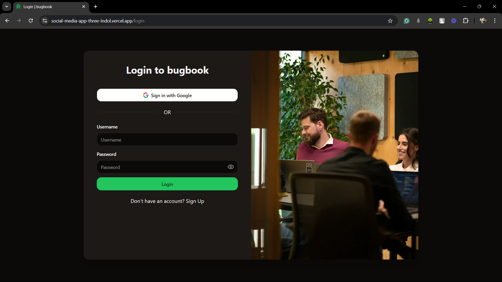
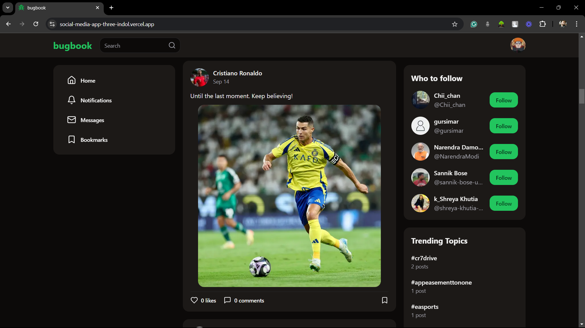
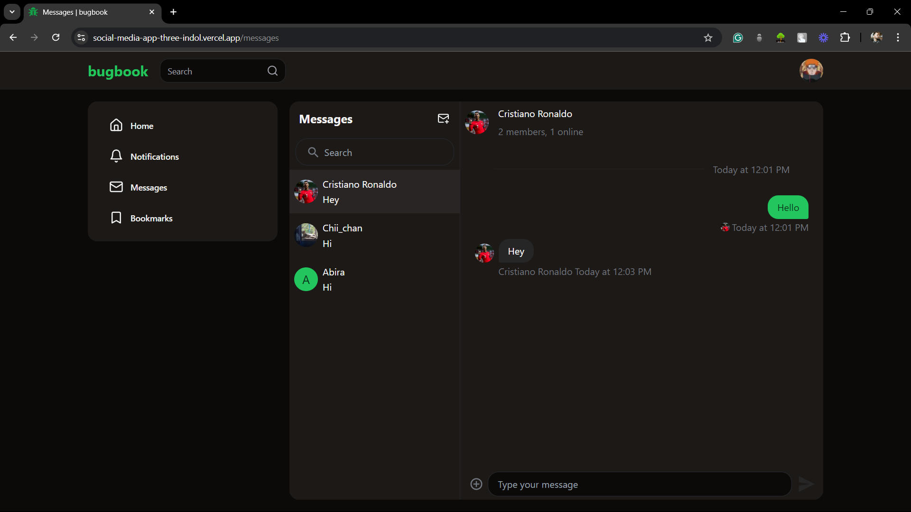

# Bugbook - A Full-Stack Social Media Web App

Bugbook is a full-stack social media platform designed to provide users with a modern, fast, and real-time social media experience. Developed using Next.js with a server-side focus, Bugbook offers seamless authentication, infinite scrolling, real-time chat, and a responsive design with light/dark mode support.

## Table of Contents

- [Features](#features)
- [Tech Stack](#tech-stack)
- [Screenshots](#screenshots)
- [Getting Started](#getting-started)
  - [Prerequisites](#prerequisites)
  - [Installation](#installation)
  - [Running the App](#running-the-app)
- [Project Structure](#project-structure)
- [Environment Variables](#environment-variables)
- [Deployment](#deployment)
- [License](#license)

## Features

- **User Authentication:** Google OAuth2 and custom authentication using Lucia Auth.
- **Infinite Scrolling:** Continuous feed scrolling for content discovery.
- **Drag-and-Drop File Uploads:** Easily share images, videos, and other files.
- **Real-Time Chat:** Integrated messaging system using Stream Chat.
- **Optimistic UI Updates:** React Query ensures fast, responsive updates.
- **Responsive UI:** Dark/light themes and mobile-friendly design with Tailwind CSS and Shadcn UI.
- **Vercel Deployment:** Fast and reliable with caching and cron job scheduling.

## Tech Stack

- **Frontend:** Next.js, TypeScript, Tailwind CSS, Shadcn UI
- **Backend:** Next.js API routes, Prisma ORM, PostgreSQL
- **Authentication:** Google OAuth2, Lucia Auth
- **Real-Time Communication:** Stream Chat API
- **Data Management:** React Query
- **Deployment:** Vercel

## Screenshots

| Login Page | Feed Page | Real-Time Chat |
|------------|-----------|----------------|
|  |  |  |

---

## Getting Started

This project is bootstrapped with [create-next-app](https://nextjs.org/docs/app/api-reference/create-next-app).

To start the development server, follow these instructions:

### Prerequisites

- **Node.js** (>= 16.0.0)
- **PostgreSQL** (>= 12.0.0)
- **Stream Chat API**: Get API keys from [Stream](https://getstream.io/).

### Installation

1. Clone the repository:

   ```bash
   git clone https://github.com/yourusername/bugbook.git
   cd bugbook
   ```

2. Install dependencies:

   ```bash
   npm install
   ```

3. Set up PostgreSQL:

   Create a PostgreSQL database and configure the connection string in the `.env` file (see [Environment Variables](#environment-variables)).

4. Prisma Setup:

   Generate the Prisma client and apply migrations:

   ```bash
   npx prisma generate
   npx prisma migrate dev --name init
   ```

### Running the App

1. Run the development server:

   ```bash
   npm run dev
   ```

   Open [http://localhost:3000](http://localhost:3000) in your browser to see the result.

2. You can start editing the app by modifying `app/page.tsx`. The page auto-updates as you edit the file.

### Building for Production

To build the app for production:

```bash
npm run build
npm start
```

---

## Project Structure

```bash
├── prisma                 # Prisma schema and migrations
├── public                 # Public assets
├── src
│   ├── components         # Reusable React components
│   ├── pages              # Next.js pages
│   ├── styles             # Global and component-specific styles
│   ├── utils              # Utility functions
│   └── lib                # Prisma client, auth setup, and API integrations
├── screenshots            # Project screenshots
├── .env                   # Environment variables
├── .env.example           # Example environment configuration
├── package.json           # NPM dependencies and scripts
└── README.md              # Project documentation
```

---

## Environment Variables

To configure your app, create a `.env` file in the project root and add the following variables:

```bash
POSTGRES_URL=YOUR_POSTGRES_URL
POSTGRES_PRISMA_URL=YOUR_POSTGRES_PRISMA_URL
POSTGRES_URL_NO_SSL=YOUR_POSTGRES_URL_NO_SSL
POSTGRES_URL_NON_POOLING=YOUR_POSTGRES_URL_NON_POOLING
POSTGRES_USER="default"
POSTGRES_HOST=YOUR_POSTGRES_HOST
POSTGRES_PASSWORD=YOUR_POSTGRES_PASSWORD
POSTGRES_DATABASE="verceldb"

GOOGLE_CLIENT_ID= YOUR_GOOGLE_CLIENT_ID 
GOOGLE_CLIENT_SECRET=YOUR_GOOGLE_CLIENT_SECRET 

UPLOADTHING_SECRET=YOUR_UPLOADTHING_SECRET
NEXT_PUBLIC_UPLOADTHING_APP_ID=YOUR_NEXT_PUBLIC_UPLOADTHING_APP_ID

NEXT_PUBLIC_STREAM_KEY=YOUR_NEXT_PUBLIC_STREAM_KEY 
STREAM_SECRET=STREAM_SECRET 


CORN_SECRET=YOUR_CORN_SECRET 
NEXT_PUBLIC_BASE_URL="http://localhost:3000"
```

---

## Deployment

To deploy your app on Vercel:

1. Commit and push your code to GitHub.
2. Connect your GitHub repository to [Vercel](https://vercel.com/new).
3. Add the environment variables in the Vercel dashboard.
4. Deploy the app.

For detailed instructions, refer to the [Next.js Deployment Documentation](https://nextjs.org/docs/app/building-your-application/deploying).

---

## License

This project is licensed under the MIT License. See the [LICENSE](./LICENSE) file for more information.
